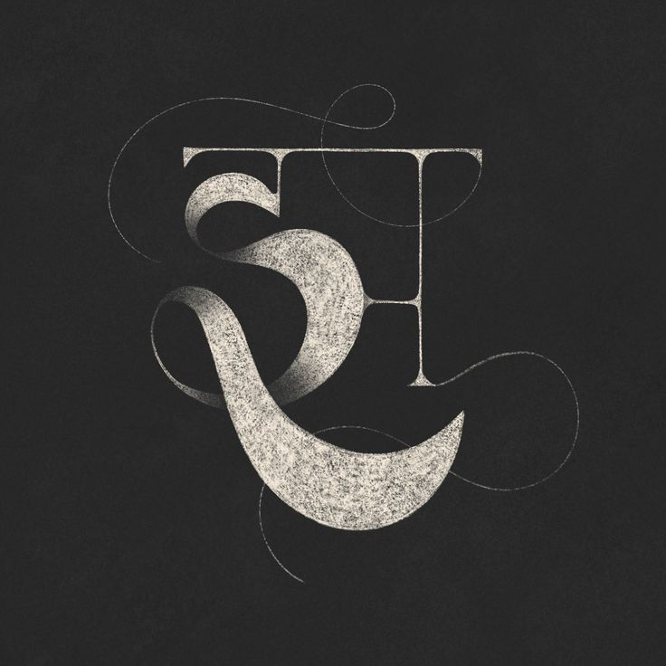

<div align="center">
  
</div>

# Deep Learning for Devanagari Character Identification

Welcome to the **Deep Learning for Devanagari Character Identification** repository. This project aims to develop a powerful deep-learning model capable of accurately classifying Devanagari characters. The Devanagari script is widely used for languages such as Hindi, Sanskrit, Nepali, Marathi, and more.

## Dataset

We utilize the [Devanagari Handwritten Character Dataset](https://www.kaggle.com/rishianand/devanagari-character-dataset) for training and evaluation. The dataset includes thousands of labeled images of Devanagari characters, organized as follows:

dataset/
training/
character_1/
image1.png
image2.png
...
character_2/
image1.png
image2.png
...
...
testing/
character_1/
image1.png
image2.png
...
character_2/
image1.png
image2.png
...
...


## Dependencies

Ensure you have the following dependencies installed:

- Python (>=3.6)
- TensorFlow (>=2.0)
- NumPy
- Matplotlib

## Usage

1. **Clone this repository:**

   ```bash
   git clone https://github.com/ruturaj0626/Deep-Learning-Identify-Devanagari-Character.git
   cd Deep-Learning-Identify-Devanagari-Character
   ```

2. **Download and Organize the Dataset:**

   Download the Devanagari Handwritten Character Dataset and organize it as described above.

3. **Train the Model:**

   ```bash
   python train.py
   ```

4. **Evaluate the Model:**

   ```bash
   python evaluate.py
   ```

5. **Use the Model for Predictions:**

   ```bash
   python predict.py path/to/your/image.png
   ```

## Results

Share an overview of the model's performance on the test dataset and highlight insights gained from the evaluation process.

## License

This project is licensed under the [MIT License](LICENSE).

## Acknowledgments

- [Devanagari Handwritten Character Dataset](https://www.kaggle.com/rishianand/devanagari-character-dataset) by Rishi Anand on Kaggle.
- Inspirations and guidance from similar projects in the deep learning community.


**Connect with Me:**
[GitHub](https://github.com/ruturaj0626) | [LinkedIn](https://www.linkedin.com/in/ruturaj-ranpise/)
